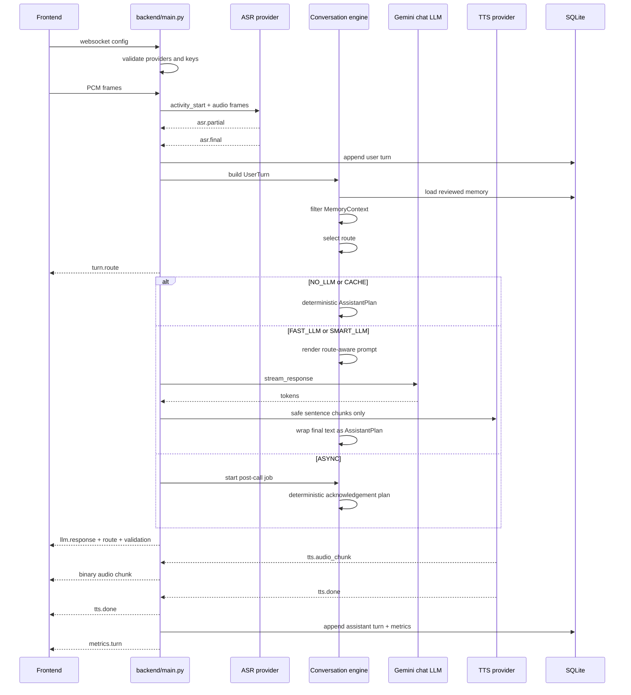

# Conversation Pipeline Data Flow

This document visualizes the current backend integration after the Engineer A conversation-intelligence slice. It is meant to show where ASR/TTS runtime work, conversation planning, memory, post-call analysis, and frontend events meet.

## Current High-Level Flow

```mermaid
flowchart LR
  UI[Frontend console]
  CFG[WS config\nproviders + runtime flags]
  WS[backend/main.py\n/ws/{session_id}]
  VALIDATE[Provider + key validation]
  VAD[Local manual VAD\nbarge-in detection]
  ASR[ASR provider\ngemini_live | openai_realtime | mock]
  ASRFINAL[asr.final]
  DBUSER[(turns table\nuser turn)]

  MEMLOAD[(memory_blobs)]
  MEMFILTER[Memory filter\nreviewed + relevant + safe]
  USERTURN[UserTurn\nconversation contract]
  ROUTER[Task router\nlane + route + reason]

  DETPLAN[Deterministic planner\nNO_LLM | CACHE | ASYNC ack]
  PROMPT[Route-aware prompt render\nstable prompt + phrase manifest + memory]
  LLM[Live chat LLM\nGemini stream]
  SAFETY[Streaming speech guard\nblock private-memory leak]
  PLAN[AssistantPlan\ndisplay + spoken segments + validation]

  TTS[TTS runtime\nsentence streaming]
  AUDIO[tts.audio_chunk]
  DONE[tts.done]
  METRICS[metrics.turn]
  DBASSIST[(turns table\nassistant turn + metrics)]

  POSTJOB[Post-call eval job]
  REPORT[(sessions.post_call_eval_json)]
  SUGGEST[Memory suggestions\npending | accepted | rejected]
  REVIEW[(memory_suggestion_decisions)]

  UI --> CFG --> WS --> VALIDATE --> VAD --> ASR --> ASRFINAL
  ASRFINAL --> DBUSER
  ASRFINAL --> MEMLOAD --> MEMFILTER --> USERTURN
  ASRFINAL --> USERTURN --> ROUTER
  ROUTER -->|NO_LLM/CACHE| DETPLAN --> PLAN
  ROUTER -->|FAST_LLM/SMART_LLM| PROMPT --> LLM --> SAFETY --> PLAN
  ROUTER -->|ASYNC| POSTJOB --> REPORT --> SUGGEST --> REVIEW
  ROUTER -->|ASYNC ack| DETPLAN
  PLAN --> TTS --> AUDIO --> UI
  TTS --> DONE --> UI
  PLAN --> METRICS --> UI
  METRICS --> DBASSIST
```

## Live Turn Sequence



## Memory And Post-Call Review Flow

```mermaid
flowchart TD
  CALL[Completed session turns]
  ANALYZE[Post-call analysis\nsummary + sentiment + outcome]
  CANDIDATES[Memory candidates\nrequires_review=true]
  API1[GET /sessions/{id}/memory-suggestions]
  OPERATOR[User/operator review]
  ACCEPT[POST decision=accepted]
  REJECT[POST decision=rejected]
  MEMORY[(memory_blobs\nreviewed memory)]
  DECISIONS[(memory_suggestion_decisions)]
  FUTURE[Future live call\nmemory toggle on]
  FILTER[filter_memory_for_turn]
  PROMPT[Rendered live prompt]

  CALL --> ANALYZE --> CANDIDATES --> API1 --> OPERATOR
  OPERATOR --> ACCEPT --> MEMORY
  ACCEPT --> DECISIONS
  OPERATOR --> REJECT --> DECISIONS
  MEMORY --> FUTURE --> FILTER --> PROMPT
```

## Ownership Map

```mermaid
flowchart TB
  subgraph Engineer_A[Engineer A: Conversation Intelligence]
    A1[UserTurn / AssistantPlan / SpokenSegment]
    A2[Task routing]
    A3[Prompt rendering]
    A4[Memory filtering]
    A5[Post-call analysis]
    A6[Memory suggestion decisions]
    A7[Display/spoken validation]
  end

  subgraph Engineer_B[Engineer B: Voice Runtime]
    B1[ASR adapters]
    B2[VAD + barge-in]
    B3[TTS providers]
    B4[Phrase audio cache]
    B5[Playback queue]
    B6[Latency instrumentation]
  end

  CONTRACT[Shared contract\nUserTurn -> AssistantPlan -> SpokenSegment[]]
  EVENTS[Shared event surface\nturn.route, llm.response, tts.audio_chunk, tts.done, metrics.turn]

  Engineer_A --> CONTRACT
  Engineer_B --> CONTRACT
  CONTRACT --> EVENTS
```

## Backend Surfaces

| Surface | Purpose |
| --- | --- |
| `GET /sessions` | Session history with turn metrics. |
| `GET /sessions/{session_id}/post-call-report` | Generate or return stored post-call analysis. |
| `GET /sessions/{session_id}/memory-suggestions` | Return pending/accepted/rejected suggestions from post-call candidates. |
| `POST /memory-suggestions/{suggestion_id}/decision` | Accept or reject a memory suggestion. Accepted suggestions become reviewed memory. |
| `GET /users/{user_id}/memory` | Return reviewed memory for a user. |
| `PUT /users/{user_id}/memory` | Replace reviewed memory for a user. |
| `WS /ws/{session_id}` | Live V2V loop with route, prompt, TTS, transcript, and metrics events. |

## Current Known Boundaries

- Phrase IDs exist in the conversation planner, but Engineer B still owns deterministic phrase-audio cache keys and runtime segment consumption.
- Live LLM is currently Gemini, so route model metadata maps FAST/SMART lanes to Gemini chat model config.
- Safety guard blocks known private reviewed-memory leaks before sentence TTS, but broader safety classification is still a future layer.
- Memory suggestions are deterministic and reviewable, not automatically saved.

